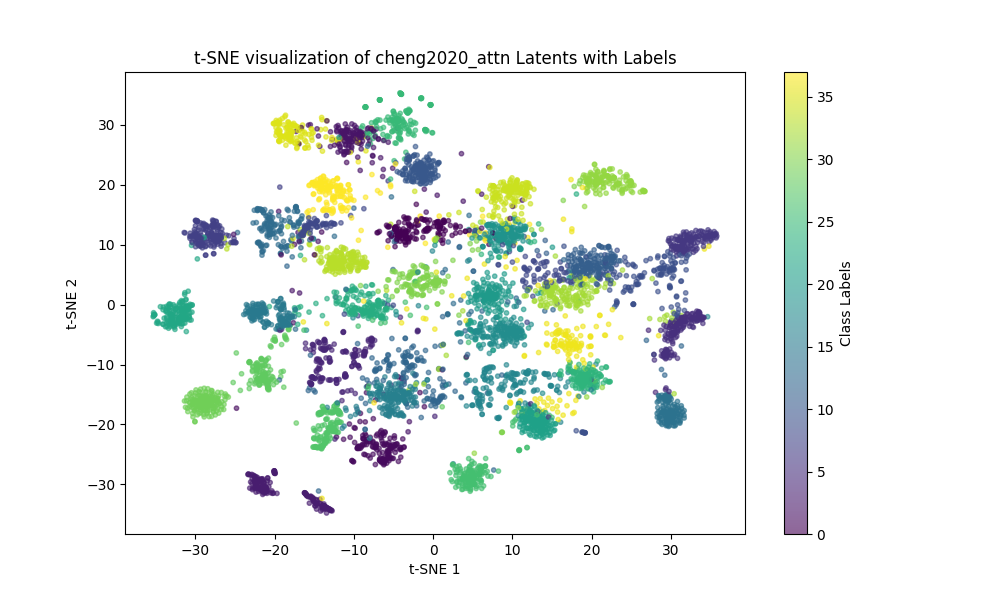
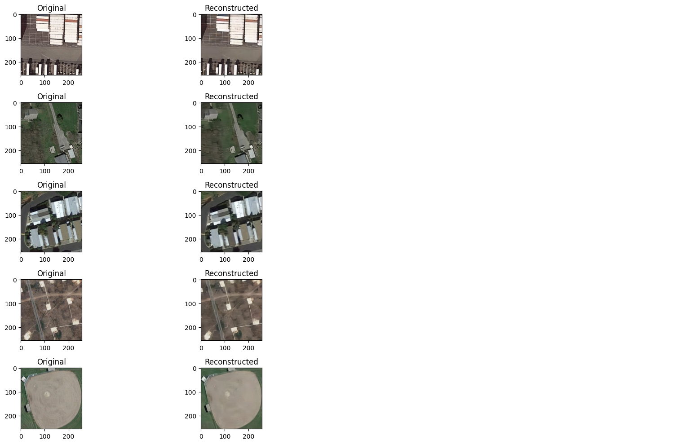

# Optimizing Satellite Image Analysis: Leveraging Variational Autoencoders for Direct Classification

## Overview
This repository contains the implementation of the methodologies described in our publication:
**"Optimizing Satellite Image Analysis: Leveraging Variational Autoencoders for Direct Classification."**

In this study, we propose using latent representations from Variational Autoencoders (VAEs) directly for downstream machine learning tasks like classification, without requiring explicit reconstruction. Our experiments demonstrate significant improvements in classification performance while maintaining efficient compression and reconstruction quality.

- Full paper can be found at https://ieeexplore.ieee.org/abstract/document/10810431
## Features

Implementation of neural compression models using advanced Variational Autoencoder architectures.

Fine-tuning workflows to optimize latent representations for classification tasks.

Comprehensive evaluation metrics, including Rate Distortion Accuracy Index (RDAI).

Support for popular satellite image datasets: EuroSAT, RSI-CB256, and PatternNet.

## Repository Structure

```Compressive VAE for Satellite Classification/
├── README.md              # Clear project overview
├── LICENSE                # Licensing information
├── requirements.txt       # Python dependencies
├── data/                  # Placeholder for datasets
│   ├── README.md               # Unprocessed data
├── notebooks/             # Jupyter notebooks for experiments and visualization
│   ├── Compress_AI_models_1.ipynb
│   ├── Compress_AI_models_2_FT.ipynb
│   ├── Plots.ipynb
├── results/               # Outputs (e.g., t-SNE plots, metrics, reconstructed images all in Tensorboard format)
├── src/                   # Source code for modular components
│   ├── models.py          # Model definitions (e.g., CompressAI, classifiers)
│   ├── train.py           # Training and evaluation workflows
│   ├── fine_tuning.py     # Fine-tuning VAE models
│   ├── utils.py           # Helper functions (e.g., data loaders, visualization)
└── .gitignore             # Ignored files and folders
```

## Installation

Clone the repository:

git clone https://github.com/AlessandroAI/Compressive_VAE_Satellite_Classification
cd Satellite-Image-Analysis-with-VAE

Install dependencies:

pip install -r requirements.txt

## Usage

Running Notebooks

Open the Jupyter notebooks in the notebooks/ folder to:

- Train neural compression models.

- Evaluate classification tasks on latent representations.

- Visualize t-SNE plots of latent spaces.

## Running Scripts

Prepare the dataset in the data/raw/ directory.

Train and evaluate models using the scripts in the src/ folder:

- python src/vae.py --dataset EuroSAT --epochs 50
- python src/fine_tuning.py --vae_model cheng2020_attn --classifier Transformer

## Datasets

EuroSAT: Sentinel-2 satellite imagery dataset.

RSI-CB256: Land-use classification dataset.

PatternNet: Urban and suburban satellite image dataset.

## Results

### Results

#### Key Metrics
We evaluated the performance of various neural compression models and classification architectures using the EuroSAT dataset. Key metrics include:
- **BPP (Bits Per Pixel)**: Measures compression efficiency.
- **PSNR (Peak Signal-to-Noise Ratio)**: Indicates reconstruction quality.
- **F1 Score**: Reflects classification performance.
- **RDAI (Rate-Distortion-Accuracy Index)**: A composite metric balancing compression, reconstruction, and classification.

| **Model**           | **Classifier** | **Accuracy** | **F1**  | **BPP**  | **PSNR**  | **RDAI**  |
|---------------------|----------------|--------------|---------|----------|-----------|-----------|
| bmshj2018 hyperprior | Transformer    | 0.937        | 0.937   | 0.2816   | 49.14     | 0.861     |
| cheng2020 attn       | Transformer    | 0.9487       | 0.9487  | 0.2615   | 44.94     | 0.890     |
| mbt2018 mean         | Transformer    | 0.9387       | 0.9387  | 0.4037   | 45.4      | 0.884     |

#### Highlights
1. **Model Comparisons**:
   - Fine-tuned **cheng2020 attn** achieved the highest RDAI score (0.890), balancing compression and classification performance.
   - **bmshj2018 hyperprior** demonstrated excellent reconstruction quality (PSNR: 49.14) and high F1 scores (0.937).

2. **Performance Over JPEG**:
   - Neural compression models outperformed JPEG compression across all metrics, achieving higher classification accuracy at lower bit rates.

3. **Latent Space Insights**:
   - **t-SNE visualizations** reveal clear class separations in the latent space, particularly with **cheng2020 attn**, indicating effective feature encoding.

#### Visualizations
- **Reconstruction Quality**: Metrics demonstrate significant improvement in PSNR and F1 scores with neural compression models compared to traditional methods.

- **t-SNE Visualization**:
  Below is a t-SNE visualization for the latent spaces of **cheng2020 attn**:

  

- **Reconstructed Images**:
  Example comparison of original and reconstructed images:

  


#### Ablation Studies
- Variations in loss weighting parameters (e.g., λclass, λbpp) show:
  - Excessive emphasis on compression reduces reconstruction and classification quality.
  - Balanced weighting achieves the best trade-offs, with λrec = 10, λclass = 1, λbpp = 0.075 yielding the highest RDAI.


## Citation

If you use this repository, please cite our paper:

@ARTICLE{10810431,
  author={Giuliano, Alessandro and Andrew Gadsden, S. and Yawney, John},
  journal={IEEE Transactions on Geoscience and Remote Sensing}, 
  title={Optimizing Satellite Image Analysis: Leveraging Variational Autoencoders Latent Representations for Direct Integration}, 
  year={2025},
  volume={63},
  number={},
  pages={1-23},
  keywords={Image coding;Satellite images;Data models;Image reconstruction;Transform coding;Machine learning;Satellites;Hyperspectral imaging;Data compression;Computational modeling;Neural compression;remote sensing;variational autoencoders (VAEs)},
  doi={10.1109/TGRS.2024.3520879}}

## License

This project is licensed under the MIT License. See the LICENSE file for details.

## Acknowledgments

CompressAI Library for neural compression models.

Support from McMaster University.

For more information, contact giuliana@mcmaster.ca.

